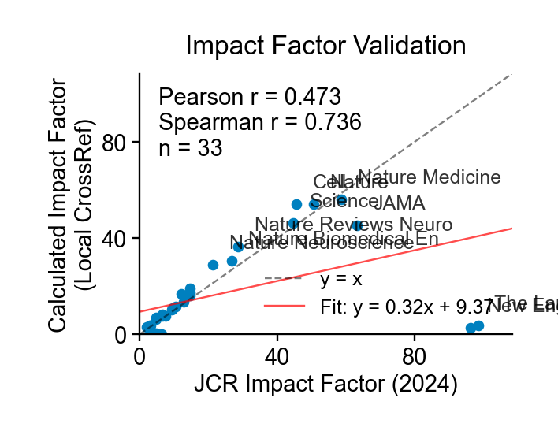

# CrossRef Local

Local CrossRef database with 167M+ scholarly works, full-text search, and impact factor calculation.

[](https://github.com/ywatanabe1989/crossref-local/actions/workflows/test.yml)
[](https://www.python.org/downloads/)
[](LICENSE)

<p align="center">
  
  
  <br>
  <em>Impact Factor Validation (r=0.74) &nbsp;|&nbsp; Citation Network Visualization</em>
</p>

<details>
<summary><strong>Why CrossRef Local?</strong></summary>

**Built for the LLM era** - features that matter for AI research assistants:

| Feature | Benefit |
|---------|---------|
| 📝 **Abstracts** | Full text for semantic understanding |
| 📊 **Impact Factor** | Filter by journal quality |
| 🔗 **Citations** | Prioritize influential papers |
| ⚡ **Speed** | 167M records in ms, no rate limits |

Perfect for: RAG systems, research assistants, literature review automation.

</details>

<details>
<summary><strong>Installation</strong></summary>

```bash
pip install crossref-local
```

From source:
```bash
git clone https://github.com/ywatanabe1989/crossref-local
cd crossref-local && make install
```

Database setup (1.5 TB, ~2 weeks to build):
```bash
# 1. Download CrossRef data (~100GB compressed)
aria2c "https://academictorrents.com/details/..."

# 2. Build SQLite database (~days)
pip install dois2sqlite
dois2sqlite build /path/to/crossref-data ./data/crossref.db

# 3. Build FTS5 index (~60 hours) & citations table (~days)
make fts-build-screen
make citations-build-screen
```

</details>

<details>
<summary><strong>Python API</strong></summary>

```python
from crossref_local import search, get, count

# Full-text search (22ms for 541 matches across 167M records)
results = search("hippocampal sharp wave ripples")
for work in results:
    print(f"{work.title} ({work.year})")

# Get by DOI
work = get("10.1126/science.aax0758")
print(work.citation())

# Count matches
n = count("machine learning")  # 477,922 matches
```

Async API:
```python
from crossref_local import aio

async def main():
    counts = await aio.count_many(["CRISPR", "neural network", "climate"])
    results = await aio.search("machine learning")
```

</details>

<details>
<summary><strong>CLI</strong></summary>

```bash
crossref-local search "CRISPR genome editing" -n 5
crossref-local get 10.1038/nature12373
crossref-local impact-factor Nature -y 2023  # IF: 54.067
```

</details>

<details>
<summary><strong>Impact Factor</strong></summary>

```python
from crossref_local.impact_factor import ImpactFactorCalculator

with ImpactFactorCalculator() as calc:
    result = calc.calculate_impact_factor("Nature", target_year=2023)
    print(f"IF: {result['impact_factor']:.3f}")  # 54.067
```

| Journal | IF 2023 |
|---------|---------|
| Nature | 54.07 |
| Science | 46.17 |
| Cell | 54.01 |
| PLOS ONE | 3.37 |

</details>

<details>
<summary><strong>Citation Network</strong></summary>

```python
from crossref_local import get_citing, get_cited, CitationNetwork

citing = get_citing("10.1038/nature12373")  # 1539 papers
cited = get_cited("10.1038/nature12373")

# Build visualization (like Connected Papers)
network = CitationNetwork("10.1038/nature12373", depth=2)
network.save_html("citation_network.html")  # requires: pip install crossref-local[viz]
```

</details>

<details>
<summary><strong>Performance</strong></summary>

| Query | Matches | Time |
|-------|---------|------|
| `hippocampal sharp wave ripples` | 541 | 22ms |
| `machine learning` | 477,922 | 113ms |
| `CRISPR genome editing` | 12,170 | 257ms |

Searching 167M records in milliseconds via FTS5.

</details>


---

<p align="center">
  <a href="https://scitex.ai"></a>
  <br>
  AGPL-3.0 · ywatanabe@scitex.ai
</p>
