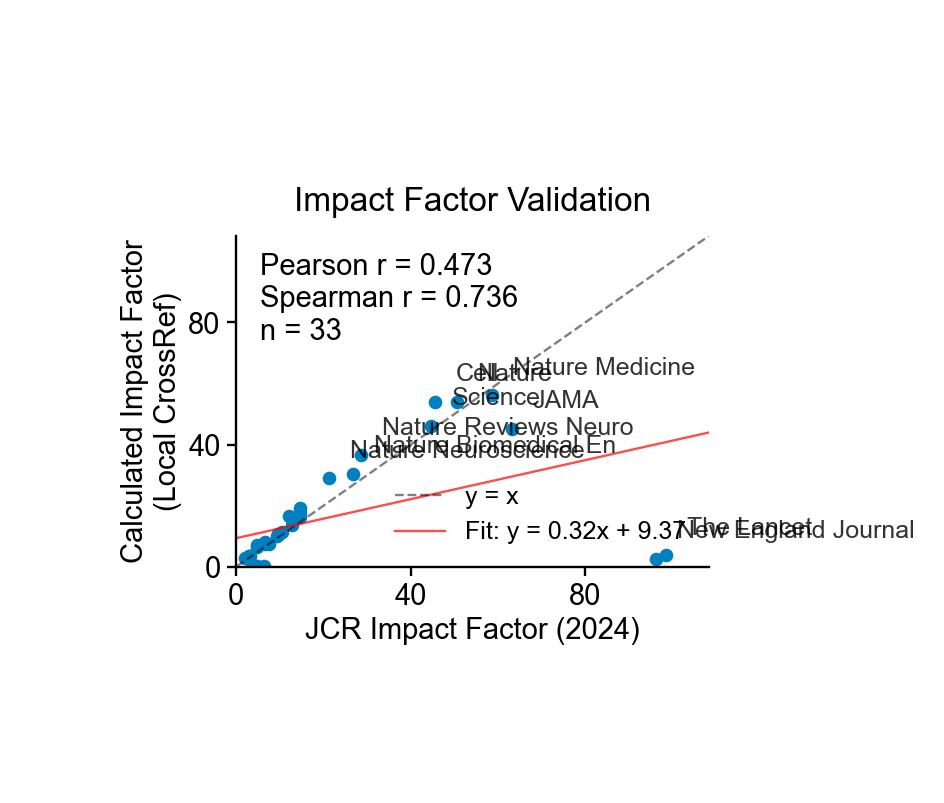

# CrossRef Local

Local CrossRef database with 167M+ scholarly works, full-text search, and impact factor calculation.

[](https://github.com/ywatanabe1989/crossref-local/actions/workflows/test.yml)
[](https://mybinder.org/v2/gh/ywatanabe1989/crossref-local/develop?labpath=examples%2Fquickstart.ipynb)
[](https://www.python.org/downloads/)
[](LICENSE)

## Impact Factor Validation

<p align="center">
  
</p>

Our calculated impact factors correlate with JCR 2024 (Spearman r = 0.74, n = 33 journals).

## Why CrossRef Local?

**Built for the LLM era** - features that matter for AI research assistants:

| Feature | Benefit |
|---------|---------|
| 📝 **Abstracts** | Full text for semantic understanding |
| 📊 **Impact Factor** | Filter by journal quality |
| 🔗 **Citations** | Prioritize influential papers |
| ⚡ **Speed** | 167M records in ms, no rate limits |

Perfect for: RAG systems, research assistants, literature review automation.

## Quick Start

<details open>
<summary><strong>Installation</strong></summary>

```bash
pip install crossref-local
```

From source:
```bash
git clone https://github.com/ywatanabe1989/crossref-local
cd crossref-local && make install
```

</details>

<details open>
<summary><strong>Python API</strong></summary>

```python
from crossref_local import search, get, count

# Full-text search (22ms for 541 matches across 167M records)
results = search("hippocampal sharp wave ripples")
for work in results:
    print(f"{work.title} ({work.year})")

# Get by DOI
work = get("10.1126/science.aax0758")
print(work.citation())

# Count matches
n = count("machine learning")  # 477,922 matches
```

</details>

<details open>
<summary><strong>CLI</strong></summary>

```bash
crossref-local search "CRISPR genome editing" -n 5
crossref-local get 10.1038/nature12373
crossref-local impact-factor Nature -y 2023  # IF: 54.067
```

</details>

<details>
<summary><strong>Async API</strong></summary>

```python
from crossref_local import aio

async def main():
    # Concurrent searches
    counts = await aio.count_many(["CRISPR", "neural network", "climate"])
    # {'CRISPR': 63989, 'neural network': 579367, 'climate': 843759}

    results = await aio.search("machine learning")
    work = await aio.get("10.1038/nature12373")
```

</details>

<details>
<summary><strong>Impact Factor Calculation</strong></summary>

```python
from crossref_local.impact_factor import ImpactFactorCalculator

with ImpactFactorCalculator() as calc:
    result = calc.calculate_impact_factor("Nature", target_year=2023)
    print(f"IF: {result['impact_factor']:.3f}")  # 54.067
```

| Journal | Category | IF 2023 |
|---------|----------|---------|
| Nature | Multidisciplinary | 54.07 |
| Science | Multidisciplinary | 46.17 |
| Cell | Biology | 54.01 |
| PLOS ONE | Open Access | 3.37 |

</details>

<details>
<summary><strong>Citation Network</strong></summary>

```python
from crossref_local import get_citing, get_cited, CitationNetwork

# Get papers citing a DOI
citing = get_citing("10.1038/nature12373")  # 1539 papers

# Get papers a DOI cites
cited = get_cited("10.1038/nature12373")

# Build and visualize network (like Connected Papers)
network = CitationNetwork("10.1038/nature12373", depth=2)
network.save_html("citation_network.html")
```

</details>

## Performance

| Query | Matches | Time |
|-------|---------|------|
| `hippocampal sharp wave ripples` | 541 | 22ms |
| `machine learning` | 477,922 | 113ms |
| `CRISPR genome editing` | 12,170 | 257ms |

Searching 167M records in milliseconds via FTS5.

<details>
<summary><strong>Sample Output</strong></summary>

```
━━━━━━━━━━━━━━━━━━━━━━━━━━━━━━━━━━━━━━━━━━━━━━━━━━━━━━━━━━━━━━━━━━━━━━
  CROSSREF LOCAL - Research Database for the LLM Era
━━━━━━━━━━━━━━━━━━━━━━━━━━━━━━━━━━━━━━━━━━━━━━━━━━━━━━━━━━━━━━━━━━━━━━

  167,008,748 scholarly works | 1,788,599,072 citations indexed

  Query                               Matches       Time
  ------------------------------------------------------
  machine learning                    477,922      104ms
  CRISPR cas9                          35,728       35ms
  neural network                      579,367      138ms
  ------------------------------------------------------
  TOTAL                             1,093,017      277ms

  → 1M+ papers indexed in 277ms!
```

</details>

## Database Setup

The database is **1.5 TB** and must be built from CrossRef data.

<details>
<summary><strong>Build Steps</strong></summary>

1. Download CrossRef data (~100GB compressed):
   ```bash
   aria2c "https://academictorrents.com/details/..."
   ```

2. Build SQLite database:
   ```bash
   pip install dois2sqlite
   dois2sqlite build /path/to/crossref-data ./data/crossref.db
   ```

3. Build FTS5 index:
   ```bash
   make fts-build-screen
   ```

4. Build citations table:
   ```bash
   make citations-build-screen
   ```

</details>

<details>
<summary><strong>Testing</strong></summary>

```bash
make test-db-create  # Download 500 records from CrossRef API
make test            # Run tests
```

</details>

<details>
<summary><strong>Project Structure</strong></summary>

```
crossref_local/
├── src/crossref_local/
│   ├── api.py              # search, get, count, info
│   ├── aio.py              # Async API
│   ├── cli.py              # CLI commands
│   ├── citations.py        # Citation network
│   ├── fts.py              # Full-text search
│   └── impact_factor/      # IF calculation
├── examples/               # Usage examples
├── tests/                  # Test suite
└── data/                   # Database (gitignored)
```

</details>

<details>
<summary><strong>Roadmap</strong></summary>

- [x] Full-text search (167M works)
- [x] Impact factor calculation
- [x] Async API support
- [x] Citation network visualization
- [ ] Impact factor trends over time
- [ ] LangChain/LlamaIndex integrations

See [ROADMAP.md](ROADMAP.md) for details.

</details>

---

<p align="center">
  <a href="https://scitex.ai" target="_blank"></a>
  <br>
  AGPL-3.0 · ywatanabe@scitex.ai
</p>
