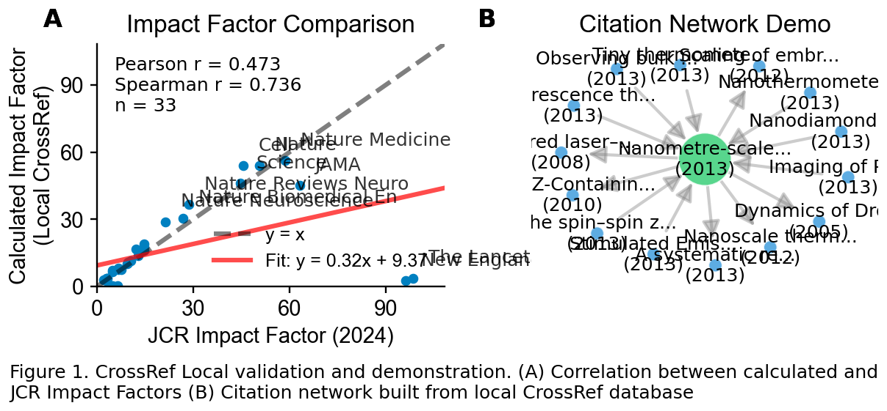

<!-- ---
!-- Timestamp: 2026-01-16 19:15:51
!-- Author: ywatanabe
!-- File: /home/ywatanabe/proj/crossref-local/README.md
!-- --- -->

# CrossRef Local (<code>crossref-local</code>)

<p align="center">
  <a href="https://scitex.ai">
    
  </a>
</p>

<p align="center"><b>Local CrossRef database with 167M+ scholarly works, full-text search, and impact factor calculation</b></p>

## Demo

<p align="center">
  
</p>

```bash
# Search 167M papers locally — no API rate limits, ~22 ms full-text query
crossref-local search "epilepsy seizure prediction"

# Resolve a DOI to full record (title, abstract, citations, journal IF)
crossref-local search-by-doi 10.1038/nature11247

# Drive from MCP / Claude Code
crossref-local mcp serve
```

The image is a live capture against the local DB; the `<details>`
block below has a 6m55s MCP-driven demo video.

## Architecture

```
┌──────────────────────────┐    ┌──────────────────────────┐
│ CrossRef public dump     │    │ JCR / OpenAlex IF tables │
│ (~100 GB compressed)     │    │                          │
└──────────────┬───────────┘    └──────────────┬───────────┘
               │ dois2sqlite                   │
               ▼                               ▼
       ┌─────────────────┐               ┌──────────────┐
       │ crossref.db     │ ◀── joins ──▶ │ impact-factor│
       │ (SQLite + FTS5) │               │ table        │
       └────────┬────────┘               └──────────────┘
                │
                ▼
   ┌──────────────────────────────────┐
   │ crossref-local — Python / CLI / MCP │
   │   search · search-by-doi · cache    │
   │   stats · check-citations · relay   │
   └──────────────────────────────────┘
```

The DB lives entirely on disk; `crossref-local` is a thin facade over
SQLite + FTS5 + a small impact-factor table. No network calls during
queries; rebuild scripts under `make fts-build-screen` /
`citations-build-screen` are the only producers of state.

[](https://badge.fury.io/py/crossref-local)
[](https://crossref-local.readthedocs.io/en/latest/)
[](https://github.com/ywatanabe1989/crossref-local/actions/workflows/test.yml)
[](https://codecov.io/gh/ywatanabe1989/crossref-local)
[](https://www.python.org/downloads/)
[](LICENSE)

<details>
<summary><strong>MCP Demo Video</strong></summary>

<p align="center">
  <a href="https://scitex.ai/media/videos/crossref-local-v0.3.1-demo.mp4">
    
  </a>
</p>

Live demonstration of MCP server integration with Claude Code for `epilepsy seizure prediction` literature review:
- Full-text search on title, abstracts, and keywords across 167M papers (22ms response)

📄 [Full demo documentation](examples/demo_mcp.org) | 📊 [Generated diagrams](examples/04_mcp_demo_out/)

</details>

<details>
<summary><strong>Why CrossRef Local?</strong></summary>

**Built for the LLM era** - features that matter for AI research assistants:

| Feature | Benefit |
|---------|---------|
| 📝 **Abstracts** | Full text for semantic understanding |
| 📊 **Impact Factor** | Filter by journal quality |
| 🔗 **Citations** | Prioritize influential papers |
| ⚡ **Speed** | 167M records in ms, no rate limits |

Perfect for: RAG systems, research assistants, literature review automation.

</details>

<details>
<summary><strong>Installation</strong></summary>

```bash
pip install crossref-local
```

From source:
```bash
git clone https://github.com/ywatanabe1989/crossref-local
cd crossref-local && make install
```

Database setup (1.5 TB, ~2 weeks to build):
```bash
# 1. Download CrossRef data (~100GB compressed)
aria2c "https://academictorrents.com/details/..."

# 2. Build SQLite database (~days)
pip install dois2sqlite
dois2sqlite build /path/to/crossref-data ./data/crossref.db

# 3. Build FTS5 index (~60 hours) & citations table (~days)
make fts-build-screen
make citations-build-screen
```

</details>

<details>
<summary><strong>Python API</strong></summary>

```python
from crossref_local import search, get, count

# Full-text search (22ms for 541 matches across 167M records)
results = search("hippocampal sharp wave ripples")
for work in results:
    print(f"{work.title} ({work.year})")

# Get by DOI
work = get("10.1126/science.aax0758")
print(work.citation())

# Count matches
n = count("machine learning")  # 477,922 matches
```

Async API:
```python
from crossref_local import aio

async def main():
    counts = await aio.count_many(["CRISPR", "neural network", "climate"])
    results = await aio.search("machine learning")
```

</details>

<details>
<summary><strong>CLI</strong></summary>

```bash
crossref-local search "CRISPR genome editing" -n 5
crossref-local search-by-doi 10.1038/nature12373
crossref-local status  # Configuration and database stats
```

With abstracts (`-a` flag):
```
$ crossref-local search "RS-1 enhances CRISPR" -n 1 -a

Found 4 matches in 128.4ms

1. RS-1 enhances CRISPR/Cas9- and TALEN-mediated knock-in efficiency (2016)
   DOI: 10.1038/ncomms10548
   Journal: Nature Communications
   Abstract: Zinc-finger nuclease, transcription activator-like effector nuclease
   and CRISPR/Cas9 are becoming major tools for genome editing...
```

</details>

<details>
<summary><strong>HTTP API</strong></summary>

Start the FastAPI server:
```bash
crossref-local relay --host 0.0.0.0 --port 31291
```

Endpoints:
```bash
# Search works (FTS5)
curl "http://localhost:31291/works?q=CRISPR&limit=10"

# Get by DOI
curl "http://localhost:31291/works/10.1038/nature12373"

# Batch DOI lookup
curl -X POST "http://localhost:31291/works/batch" \
  -H "Content-Type: application/json" \
  -d '{"dois": ["10.1038/nature12373", "10.1126/science.aax0758"]}'

# Citation endpoints
curl "http://localhost:31291/citations/10.1038/nature12373/citing"
curl "http://localhost:31291/citations/10.1038/nature12373/cited"
curl "http://localhost:31291/citations/10.1038/nature12373/count"

# Collection endpoints
curl "http://localhost:31291/collections"
curl -X POST "http://localhost:31291/collections" \
  -H "Content-Type: application/json" \
  -d '{"name": "my_papers", "query": "CRISPR", "limit": 100}'
curl "http://localhost:31291/collections/my_papers/download?format=bibtex"

# Database info
curl "http://localhost:31291/info"
```

HTTP mode (connect to running server):
```bash
# On local machine (if server is remote)
ssh -L 31291:127.0.0.1:31291 your-server

# Python client
from crossref_local import configure_http
configure_http("http://localhost:31291")

# Or via CLI
crossref-local --http search "CRISPR"
```

</details>

<details>
<summary><strong>MCP Server</strong></summary>

Run as MCP (Model Context Protocol) server:
```bash
crossref-local mcp start
```

Local MCP client configuration:
```json
{
  "mcpServers": {
    "crossref-local": {
      "command": "crossref-local",
      "args": ["mcp", "start"],
      "env": {
        "CROSSREF_LOCAL_DB": "/path/to/crossref.db"
      }
    }
  }
}
```

Remote MCP via HTTP (recommended):
```bash
# On server: start persistent MCP server
crossref-local mcp start -t http --host 0.0.0.0 --port 8082
```
```json
{
  "mcpServers": {
    "crossref-remote": {
      "url": "http://your-server:8082/mcp"
    }
  }
}
```

Diagnose setup:
```bash
crossref-local mcp doctor        # Check dependencies and database
crossref-local mcp list-tools    # Show available MCP tools
crossref-local mcp installation  # Show client config examples
```

See [docs/remote-deployment.md](docs/remote-deployment.md) for systemd and Docker setup.

Available tools:
- `search` - Full-text search across 167M+ papers
- `search_by_doi` - Get paper by DOI
- `enrich_dois` - Add citation counts and references to DOIs
- `status` - Database statistics
- `cache_*` - Paper collection management

</details>

<details>
<summary><strong>Impact Factor</strong></summary>

```python
from crossref_local.impact_factor import ImpactFactorCalculator

with ImpactFactorCalculator() as calc:
    result = calc.calculate_impact_factor("Nature", target_year=2023)
    print(f"IF: {result['impact_factor']:.3f}")  # 54.067
```

| Journal | IF 2023 |
|---------|---------|
| Nature | 54.07 |
| Science | 46.17 |
| Cell | 54.01 |
| PLOS ONE | 3.37 |

</details>

<details>
<summary><strong>Citation Network</strong></summary>

```python
from crossref_local import get_citing, get_cited, CitationNetwork

citing = get_citing("10.1038/nature12373")  # 1539 papers
cited = get_cited("10.1038/nature12373")

# Build visualization (like Connected Papers)
network = CitationNetwork("10.1038/nature12373", depth=2)
network.save_html("citation_network.html")  # requires: pip install crossref-local[viz]
```

</details>

<details>
<summary><strong>Performance</strong></summary>

| Query | Matches | Time |
|-------|---------|------|
| `hippocampal sharp wave ripples` | 541 | 22ms |
| `machine learning` | 477,922 | 113ms |
| `CRISPR genome editing` | 12,170 | 257ms |

Searching 167M records in milliseconds via FTS5.

</details>

<details>
<summary><strong>Related Projects</strong></summary>

**[openalex-local](https://github.com/ywatanabe1989/openalex-local)** - Sister project with OpenAlex data:

| Feature | crossref-local | openalex-local |
|---------|----------------|----------------|
| Works | 167M | 284M |
| Abstracts | ~21% | ~45-60% |
| Update frequency | Real-time | Monthly |
| DOI authority | ✓ (source) | Uses CrossRef |
| Citations | Raw references | Linked works |
| Concepts/Topics | ❌ | ✓ |
| Author IDs | ❌ | ✓ |
| Best for | DOI lookup, raw refs | Semantic search |

**When to use CrossRef**: Real-time DOI updates, raw reference parsing, authoritative metadata.
**When to use OpenAlex**: Semantic search, citation analysis, topic discovery.

</details>


---

<p align="center">
  <a href="https://scitex.ai" target="_blank"></a>
</p>

## Installation

> **Recommended**: `uv pip install crossref-local[all]` —
> uv's Rust resolver handles the SciTeX dep set in 1-3 min where
> pip's serial backtracker can take 30+ min on the full extras.
> Plain `pip install` still works; the install block below shows both.


```bash
pip install crossref-local              # core
pip install crossref-local[mcp]         # + MCP server
```

## 4 Interfaces

<details open>
<summary><strong>Python API</strong></summary>

<br>

```python
from crossref_local import crossref_search, get_work

results = crossref_search("deep learning EEG", limit=10)
work = get_work("10.1038/nature12373")
```

</details>

<details>
<summary><strong>CLI</strong></summary>

<br>

```bash
crossref-local search "query"
crossref-local doi 10.1038/nature12373
```

</details>

<details>
<summary><strong>MCP Server</strong></summary>

<br>

```bash
crossref-local mcp start
```

</details>

<details>
<summary><strong>Skills</strong></summary>

<br>

Agent skill pages live under `src/crossref_local/_skills/crossref-local/`.

</details>

## Problem and Solution


| # | Problem | Solution |
|---|---------|----------|
| 1 | **CrossRef public API is rate-limited + requires internet + slow for bulk queries** -- 167M works is the bottleneck for literature tools | **Local SQLite + FTS5** -- full CrossRef dump (~60 GB) queryable offline; `crossref_search` returns in milliseconds |

## Part of SciTeX

`crossref-local` is part of [**SciTeX**](https://scitex.ai). Install via
the umbrella with `pip install scitex[scholar]` to use as
`scitex.scholar` (Python) or `scitex scholar ...` (CLI) — `crossref-local`
provides the local CrossRef backing for `scholar`'s DOI resolution.

```python
import scitex

scitex.scholar.enrich_bibtex("references.bib")
scitex.scholar.check_citations("manuscript.tex")
```


>Four Freedoms for Research
>
>0. The freedom to **run** your research anywhere — your machine, your terms.
>1. The freedom to **study** how every step works — from raw data to final manuscript.
>2. The freedom to **redistribute** your workflows, not just your papers.
>3. The freedom to **modify** any module and share improvements with the community.
>
>AGPL-3.0 — because we believe research infrastructure deserves the same freedoms as the software it runs on.

---

<p align="center">
  <a href="https://scitex.ai" target="_blank"></a>
</p>

<!-- EOF -->